# IOR Benchmark
Sources used for this benchmark 
- https://ior.readthedocs.io/en/latest/userDoc/tutorial.html
- https://cug.org/5-publications/proceedings_attendee_lists/2007CD/S07_Proceedings/pages/Authors/Shan/Shan_paper.pdf

## IOR single node benchmark for GPFS (Snellius)

### Finding the correct blocksize and transfersize

#### Rome
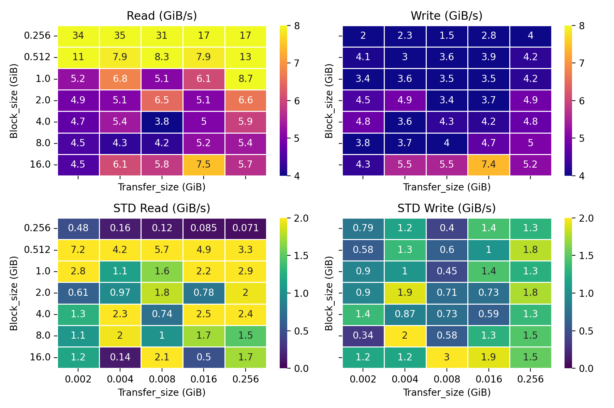

#### Fat Rome
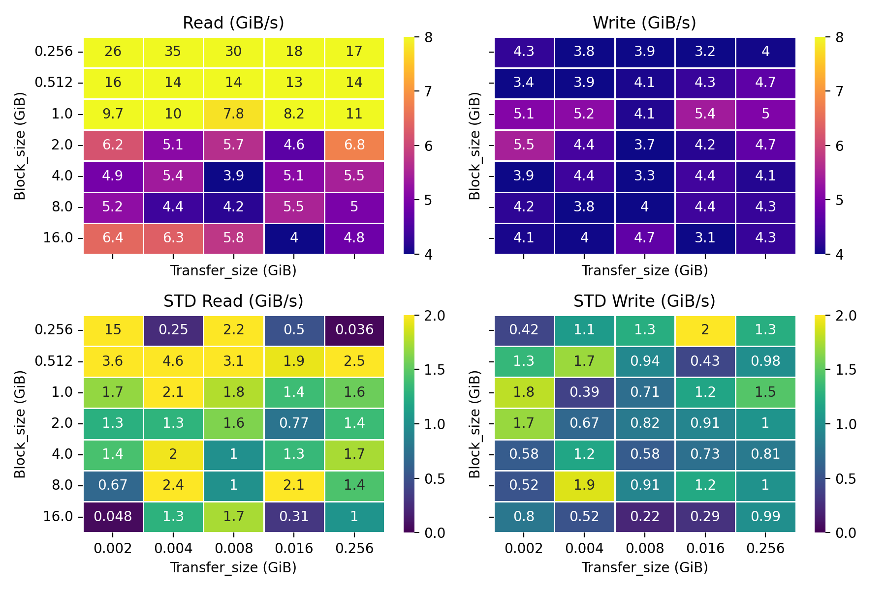

#### Fat Genoa
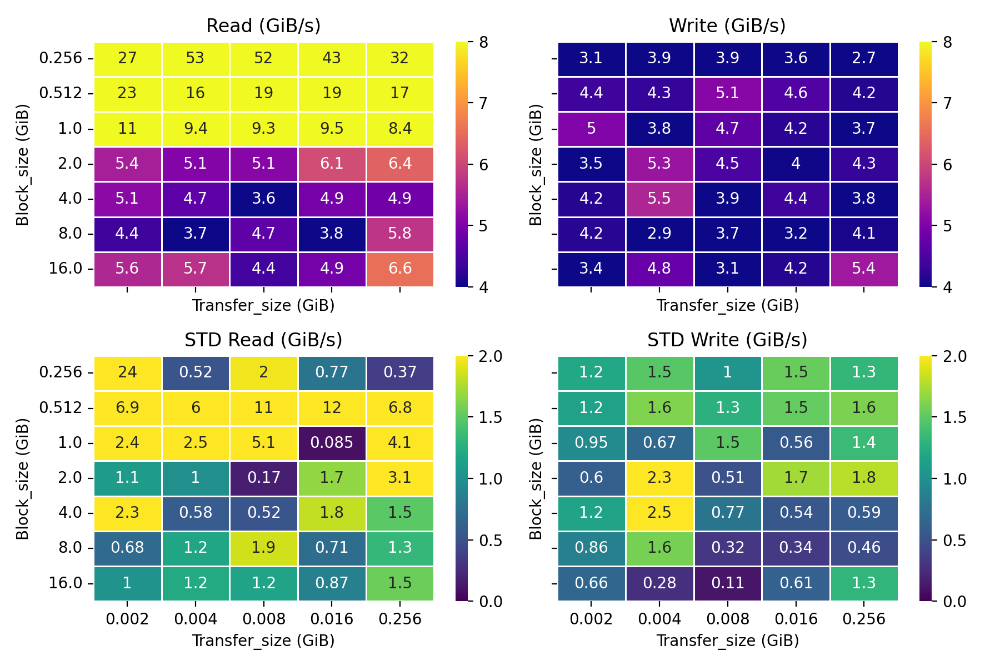

#### Fat Genoa
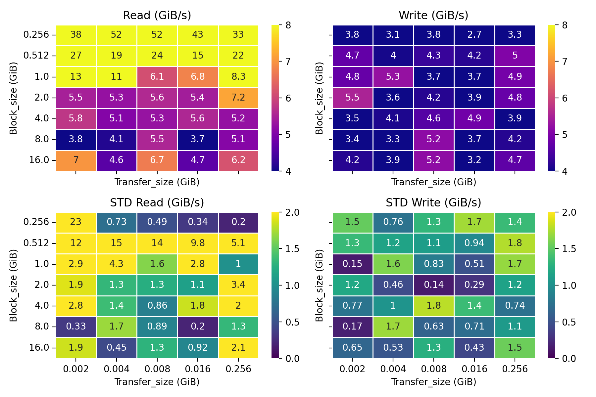

#### GCN (A100)
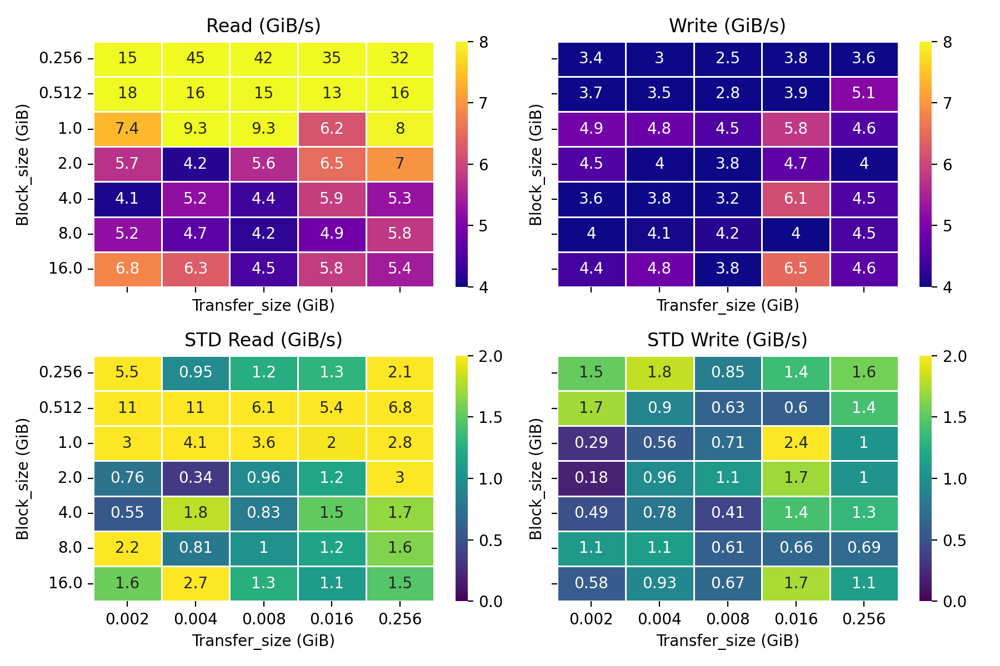

#### GCN (H100)
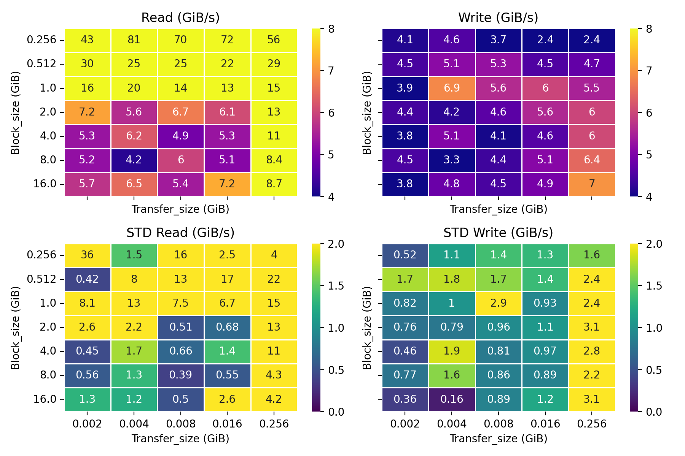

#### Varation of blocksize per transfersize 4MiB
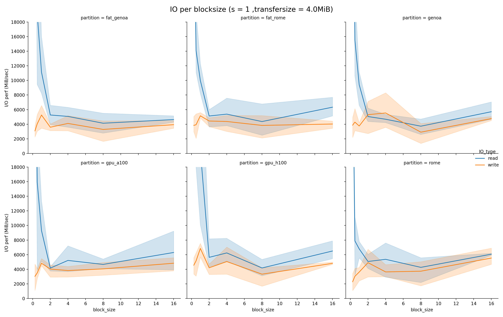

#### Varation of transfersize per blocksizesize 8GiB
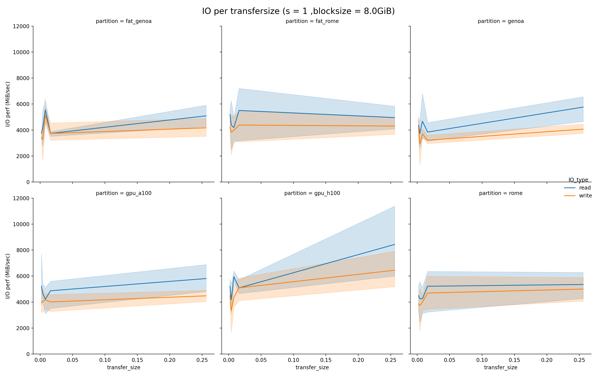

### Choosing block_size = 8GiB, transfer_size 4MiB, 8 ntasks-per-node
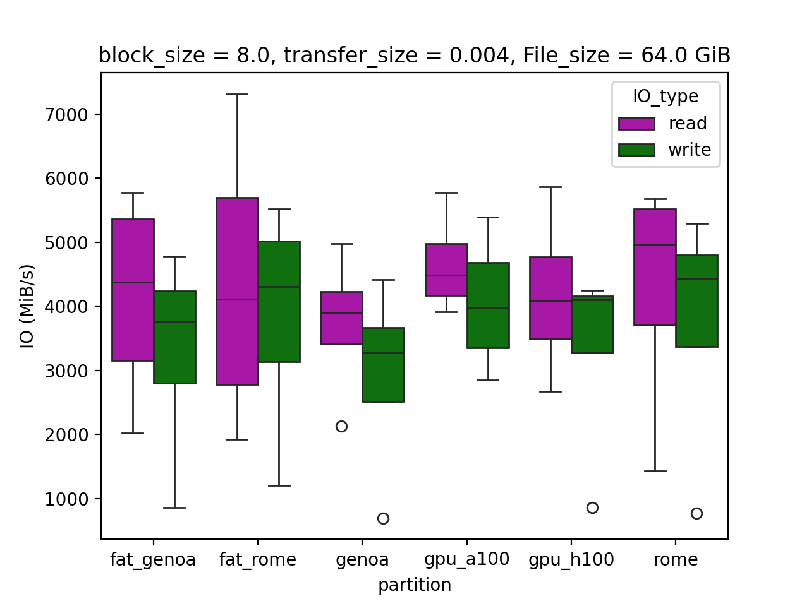

# Variation of ntasks-per-node
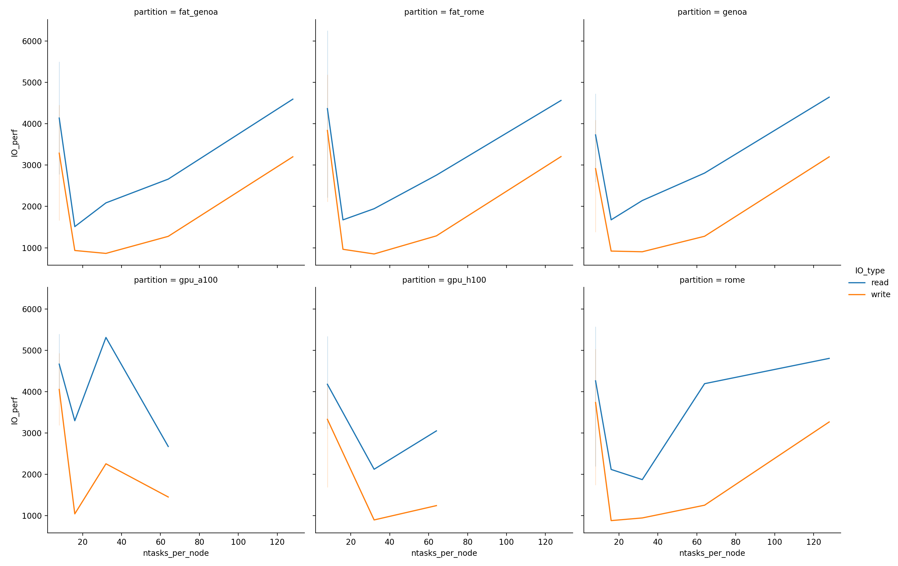

# Variation of nnodes (ntasks-per-node = 8 )
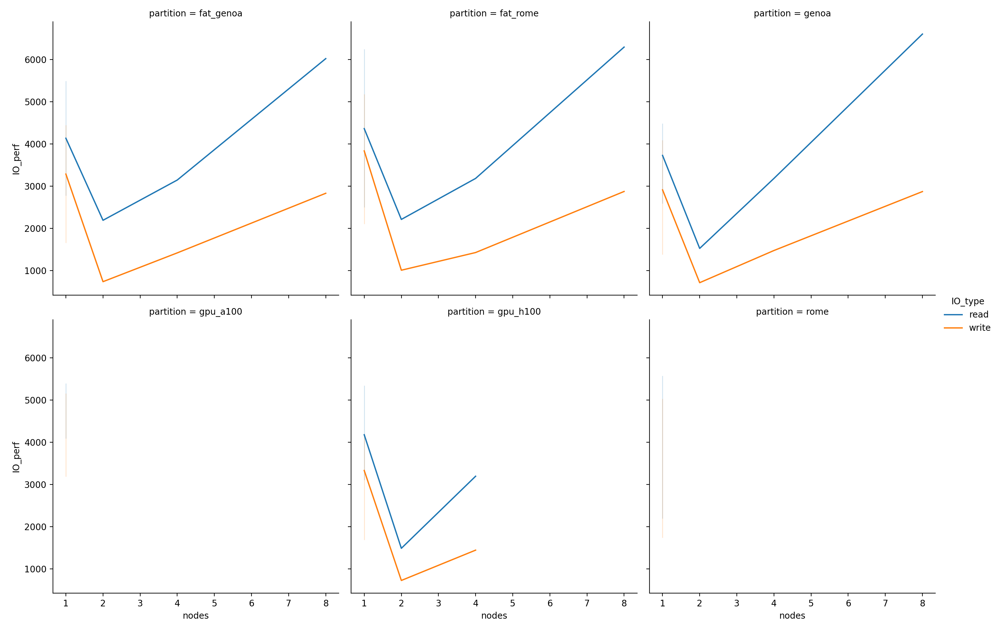
